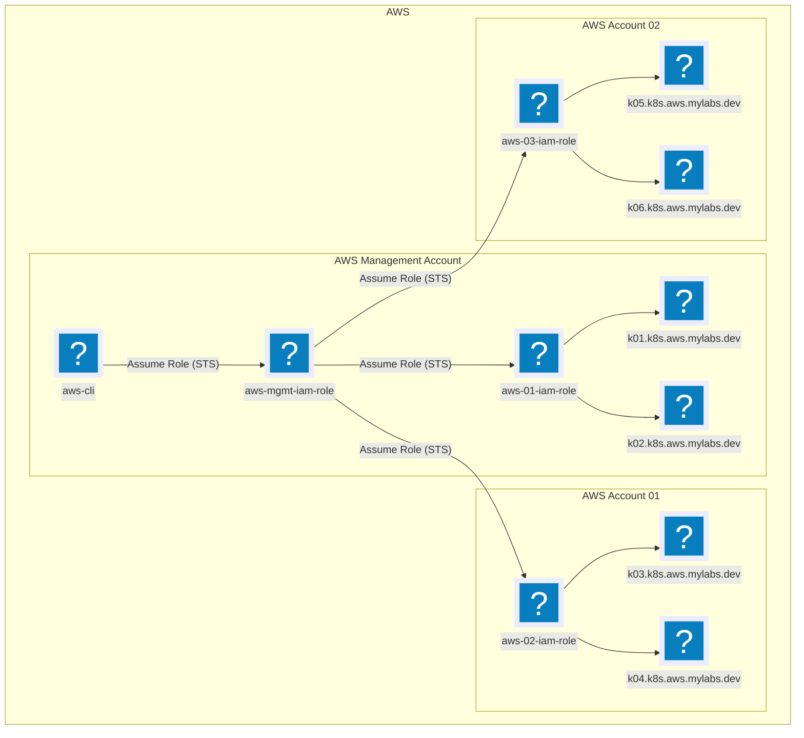

# k8s-multicluster-gitops

Infrastructure as Code (IaC) for provisioning and managing multiple Kubernetes
clusters across multiple cloud accounts, using GitOps principles with ArgoCD.

## Requirements

Guides on setting up Kubernetes clusters in the cloud are common, but few cover
managing clusters across multiple providers and accounts, a key need for large
enterprises.

This project aims to provide a practical example:

- ✅ Provisioning and managing Kubernetes clusters across multiple cloud
  providers (AWS, Azure, GCP).
- ✅ Deploying and maintaining Kubernetes clusters across multiple accounts and
  regions.

## Architecture

You likely need to deploy multiple Kubernetes clusters across various cloud
providers and accounts.

Each cloud provider has a designated "management account" where subdomains are hosted:

- `aws.mylabs.dev` - AWS
- `az.mylabs.dev` - Azure
- `gcp.mylabs.dev` - Google Cloud Platform

> The second-level domain `mylabs.dev` is hosted externally (e.g., Cloudflare),
> and it's the user's responsibility to configure DNS delegation properly.

An IAM role (or its equivalent for each cloud provider) will be created in the
management account. This role will allow GitHub Actions/mise to manage resources
in the management account and will also be used to access other accounts where
Kubernetes clusters are deployed.

## Cloud Providers - Multi-Account Setup

Let's assume you have two AWS accounts, two Azure accounts, and two GCP accounts, and you
want to deploy two Kubernetes clusters (EKS, AKS, GKE) in each account:

| Cloud Provider                                   | Account 01                                                   | Account 02                                                   |
|--------------------------------------------------|--------------------------------------------------------------|--------------------------------------------------------------|
| **AWS** (`aws.mylabs.dev`, `k8s.aws.mylabs.dev`) | `k01.k8s.aws.mylabs.dev` (US), `k02.k8s.aws.mylabs.dev` (EU) | `k03.k8s.aws.mylabs.dev` (US), `k04.k8s.aws.mylabs.dev` (EU) |
| **Azure** (`az.mylabs.dev`, `k8s.az.mylabs.dev`) | `k01.k8s.az.mylabs.dev` (US), `k02.k8s.az.mylabs.dev` (EU)   | `k03.k8s.az.mylabs.dev` (US), `k04.k8s.az.mylabs.dev` (EU)   |
| **GCP** (`gcp.mylabs.dev`, `k8s.gcp.mylabs.dev`) | `k01.k8s.gcp.mylabs.dev` (US), `k02.k8s.gcp.mylabs.dev` (EU) | `k03.k8s.gcp.mylabs.dev` (US), `k04.k8s.gcp.mylabs.dev` (EU) |

### AWS

You should have access to all your AWS accounts via the AWS CLI (using
`AWS_ACCESS_KEY_ID`, `AWS_SECRET_ACCESS_KEY`, ...)

#### Management account

Select one of your AWS accounts to serve as the management account.

##### AWS CLI User

Create an `aws-cli` [IAM user](https://us-east-1.console.aws.amazon.com/iam/home?region=us-east-1#/users)
in your management AWS account. Then, add the user's ARN to the [mise.toml](mise.toml)
file under the `env.AWS_USER_ARN` variable.

```bash
AWS_USER_NAME="aws-cli"
AWS_POLICY_ARN="arn:aws:iam::aws:policy/AdministratorAccess"

# Create IAM user
aws iam create-user --user-name "${AWS_USER_NAME}"

# Attach a policy to the user
aws iam attach-user-policy --user-name "${AWS_USER_NAME}" --policy-arn "${AWS_POLICY_ARN}"

# Create access keys for the user
aws iam create-access-key --user-name "${AWS_USER_NAME}"

# Get the ARN of the user
AWS_USER_ARN=$(aws iam list-users --query "Users[? UserName==\`${AWS_USER_NAME}\`].Arn" --output text)
sed -i "s@^AWS_USER_ARN.*@AWS_USER_ARN = \"${AWS_USER_ARN}\"@" mise.local.toml
```

The `aws-cli` user is created in the management AWS account. It will be used to
access all AWS accounts via the AWS CLI by assuming the proper IAM role.

##### Route35 Hosted Zone + GitHub Action IAM Role

The following steps will create a Route 53 hosted zone for the subdomain
`aws.mylabs.dev` and a GitHub Actions IAM role that can be assumed by the
GitHub Actions workflow.
The GitHub Actions IAM role will be used to manage resources in the management
account and to access other accounts where Kubernetes clusters are deployed.

Create a Route 53 hosted zone for `aws.mylabs.dev`:

> Ensure that the necessary environment variables are set for the AWS CLI
> (e.g., `AWS_ACCESS_KEY_ID`, `AWS_SECRET_ACCESS_KEY`).

```bash
mise run create:aws-mgmt:cf-route53-gh-action-iam-role-oidc
```

> For more details please inspect the [mise.toml](./mise.toml) file.

Next, manually set up the DNS delegation between your second-level domain
`mylabs.dev` and the `aws.mylabs.dev` hosted zone in Route 53.

Example:


#### Tenant Accounts

Create an IAM role in each tenant account that allows the management account to
assume a role in the tenant account.

> Make sure to use AWS credentials (`AWS_ACCESS_KEY_ID`,
> `AWS_SECRET_ACCESS_KEY`) for the tenant account.

```bash
mise run create:aws-tenant:cf-iam-role
```

### Azure

### GCP

## K8s Clusters

All kubeconfig files will be stored in the `clusters/.kubeconfigs`
directory.

### Kind

The [kind clusters](https://kind.sigs.k8s.io/) are created using the `kind`
tool, which is a tool for running Kubernetes clusters in Docker containers.

```bash
mise run create:kind:kind01-internal
mise run delete:kind:kind01-internal
mise run create:kind:kind02-internal
mise run delete:kind:kind02-internal
mise run create-kind-all
mise run delete-kind-all
```

### K3d

The [k3d clusters](https://k3d.io/) are created using the `k3d` tool, which
is a lightweight wrapper to run `k3s` in Docker containers.

```bash
mise run create:k3d:k3d01-internal
mise run delete:k3d:k3d01-internal
mise run create:k3d:k3d02-internal
mise run delete:k3d:k3d02-internal
mise run create-k3d-all
mise run delete-k3d-all
```

> You can also create all the clusters at once using the `create-all` and
> `delete-all` commands:
>
> ```bash
> mise run "create-kind-all" ::: "create-k3d-all"
> mise run "delete-kind-all" ::: "delete-k3d-all"
> ```

## Architecture diagrams

### DNS diagram

```mermaid
flowchart TB
  subgraph "Cloudflare"
    mylabs.dev@{ icon: "logos:cloudflare-icon", form: "square", label: "mylabs.dev", pos: "b", h: 60 }
  end

  subgraph "AWS"
    subgraph "AWS Management Account"
      aws.mylabs.dev@{ icon: "logos:aws-route53", form: "circle", label: "aws.mylabs.dev", pos: "b", h: 60 }
      k8s.aws.mylabs.dev@{ icon: "logos:aws-route53", form: "square", label: "k8s.aws.mylabs.dev", pos: "b", h: 60 }
    end
    subgraph "AWS Account 02"
      k03.k8s.aws.mylabs.dev@{ icon: "logos:aws-route53", form: "square", label: "k03.k8s.aws.mylabs.dev", pos: "b", h: 60 }
      k04.k8s.aws.mylabs.dev@{ icon: "logos:aws-route53", form: "square", label: "k04.k8s.aws.mylabs.dev", pos: "b", h: 60 }
    end
    subgraph "AWS Account 01"
      k01.k8s.aws.mylabs.dev@{ icon: "logos:aws-route53", form: "square", label: "k01.k8s.aws.mylabs.dev", pos: "b", h: 60 }
      k02.k8s.aws.mylabs.dev@{ icon: "logos:aws-route53", form: "square", label: "k02.k8s.aws.mylabs.dev", pos: "b", h: 60 }
    end
  end

  subgraph "Azure"
    subgraph "Azure Management Account"
      az.mylabs.dev@{ icon: "logos:azure-icon", form: "circle", label: "az.mylabs.dev", pos: "b", h: 60 }
      k8s.az.mylabs.dev@{ icon: "logos:azure-icon", form: "square", label: "k8s.az.mylabs.dev", pos: "b", h: 60 }
    end
    subgraph "Azure Account 02"
      k03.k8s.az.mylabs.dev@{ icon: "logos:azure-icon", form: "square", label: "k03.k8s.az.mylabs.dev", pos: "b", h: 60 }
      k04.k8s.az.mylabs.dev@{ icon: "logos:azure-icon", form: "square", label: "k04.k8s.az.mylabs.dev", pos: "b", h: 60 }
    end
    subgraph "Azure Account 01"
      k01.k8s.az.mylabs.dev@{ icon: "logos:azure-icon", form: "square", label: "k01.k8s.az.mylabs.dev", pos: "b", h: 60 }
      k02.k8s.az.mylabs.dev@{ icon: "logos:azure-icon", form: "square", label: "k02.k8s.az.mylabs.dev", pos: "b", h: 60 }
    end
  end

  subgraph "GCP"
    subgraph "GCP Management Account"
      gcp.mylabs.dev@{ icon: "logos:google-cloud", form: "circle", label: "gcp.mylabs.dev", pos: "b", h: 60 }
      k8s.gcp.mylabs.dev@{ icon: "logos:google-cloud", form: "square", label: "k8s.gcp.mylabs.dev", pos: "b", h: 60 }
    end
    subgraph "GCP Account 02"
      k03.k8s.gcp.mylabs.dev@{ icon: "logos:google-cloud", form: "square", label: "k03.k8s.gcp.mylabs.dev", pos: "b", h: 60 }
      k04.k8s.gcp.mylabs.dev@{ icon: "logos:google-cloud", form: "square", label: "k04.k8s.gcp.mylabs.dev", pos: "b", h: 60 }
    end
    subgraph "GCP Account 01"
      k01.k8s.gcp.mylabs.dev@{ icon: "logos:google-cloud", form: "square", label: "k01.k8s.gcp.mylabs.dev", pos: "b", h: 60 }
      k02.k8s.gcp.mylabs.dev@{ icon: "logos:google-cloud", form: "square", label: "k02.k8s.gcp.mylabs.dev", pos: "b", h: 60 }
    end
  end

  mylabs.dev --> aws.mylabs.dev
  aws.mylabs.dev --> k8s.aws.mylabs.dev
  k8s.aws.mylabs.dev --> k01.k8s.aws.mylabs.dev
  k8s.aws.mylabs.dev --> k02.k8s.aws.mylabs.dev
  k8s.aws.mylabs.dev --> k03.k8s.aws.mylabs.dev
  k8s.aws.mylabs.dev --> k04.k8s.aws.mylabs.dev
  mylabs.dev --> az.mylabs.dev
  az.mylabs.dev --> k8s.az.mylabs.dev
  k8s.az.mylabs.dev --> k01.k8s.az.mylabs.dev
  k8s.az.mylabs.dev --> k02.k8s.az.mylabs.dev
  k8s.az.mylabs.dev --> k03.k8s.az.mylabs.dev
  k8s.az.mylabs.dev --> k04.k8s.az.mylabs.dev
  mylabs.dev --> gcp.mylabs.dev
  gcp.mylabs.dev --> k8s.gcp.mylabs.dev
  k8s.gcp.mylabs.dev --> k01.k8s.gcp.mylabs.dev
  k8s.gcp.mylabs.dev --> k02.k8s.gcp.mylabs.dev
  k8s.gcp.mylabs.dev --> k03.k8s.gcp.mylabs.dev
  k8s.gcp.mylabs.dev --> k04.k8s.gcp.mylabs.dev
```



### AWS diagram

Suppose you have three AWS accounts and want to provision one EKS cluster in each.
The setup would look like this:

- **AWS Management Account** - centralized account responsible for provisioning
  and managing infrastructure, hosting two EKS clusters, and assuming IAM roles
  in tenant accounts
  - k01.k8s.aws.mylabs.dev
  - k02.k8s.aws.mylabs.dev
- **AWS Tenant Account 01** – tenant account hosting two EKS clusters. These
  clusters are created using a local IAM role, which is assumed by the IAM role
  from the management account
  - k03.k8s.aws.mylabs.dev
  - k04.k8s.aws.mylabs.dev
- **AWS Tenant Account 02** – tenant account hosting two EKS clusters. These
  clusters are created using a local IAM role, which is assumed by the IAM role
  from the management account
  - k05.k8s.aws.mylabs.dev
  - k06.k8s.aws.mylabs.dev



## Tests

```bash
docker run --rm -it --env GITHUB_TOKEN \
  -v "$PWD:/mnt" -v "/var/run/docker.sock:/var/run/docker.sock" \
  --workdir /mnt \
  bash bash -c 'set -euo pipefail && \
    apk add docker && \
    wget -q https://mise.run -O - | sh && \
    eval "$(~/.local/bin/mise activate bash)" && \
    mise run "create-kind-all" ::: "create-k3d-all" && \
    mise run "delete-kind-all" ::: "delete-k3d-all" \
  '
```
