# k8s-multicluster-gitops

Infrastructure as Code for provisioning multiple Kubernetes clusters, managed
using GitOps with ArgoCD

Create all "kind" clusters:

```bash
mise task run "create:kind:*"
mise task run "delete:kind:*"
```

Create all "k3d" clusters:

```bash
mise task run "create:k3d:*"
mise task run "delete:k3d:*"
```

> Same for eksctl, az, terraform-aws, terraform-az, ... clusters

## Architecture diagrams

### DNS diagram

```mermaid
flowchart TB
  subgraph "Cloudflare"
    mylabs.dev@{ icon: "logos:cloudflare-icon", form: "square", label: "mylabs.dev", pos: "b", h: 60 }
  end

  subgraph "AWS"
    subgraph "AWS Primary Account"
      aws.mylabs.dev@{ icon: "logos:aws-route53", form: "circle", label: "aws.mylabs.dev", pos: "b", h: 60 }
      k8s.aws.mylabs.dev@{ icon: "logos:aws-route53", form: "square", label: "k8s.aws.mylabs.dev", pos: "b", h: 60 }
    end
    subgraph "AWS Account 03"
      k05.k8s.aws.mylabs.dev@{ icon: "logos:aws-route53", form: "square", label: "k05.k8s.aws.mylabs.dev", pos: "b", h: 60 }
      k06.k8s.aws.mylabs.dev@{ icon: "logos:aws-route53", form: "square", label: "k06.k8s.aws.mylabs.dev", pos: "b", h: 60 }
    end
    subgraph "AWS Account 02"
      k03.k8s.aws.mylabs.dev@{ icon: "logos:aws-route53", form: "square", label: "k03.k8s.aws.mylabs.dev", pos: "b", h: 60 }
      k04.k8s.aws.mylabs.dev@{ icon: "logos:aws-route53", form: "square", label: "k04.k8s.aws.mylabs.dev", pos: "b", h: 60 }
    end
    subgraph "AWS Account 01"
      k01.k8s.aws.mylabs.dev@{ icon: "logos:aws-route53", form: "square", label: "k01.k8s.aws.mylabs.dev", pos: "b", h: 60 }
      k02.k8s.aws.mylabs.dev@{ icon: "logos:aws-route53", form: "square", label: "k02.k8s.aws.mylabs.dev", pos: "b", h: 60 }
    end
  end

  subgraph "Azure"
    subgraph "Azure Primary Account"
      az.mylabs.dev@{ icon: "logos:azure-icon", form: "circle", label: "az.mylabs.dev", pos: "b", h: 60 }
      k8s.az.mylabs.dev@{ icon: "logos:azure-icon", form: "square", label: "k8s.az.mylabs.dev", pos: "b", h: 60 }
    end
    subgraph "Azure Account 03"
      k05.k8s.az.mylabs.dev@{ icon: "logos:azure-icon", form: "square", label: "k05.k8s.az.mylabs.dev", pos: "b", h: 60 }
      k06.k8s.az.mylabs.dev@{ icon: "logos:azure-icon", form: "square", label: "k06.k8s.az.mylabs.dev", pos: "b", h: 60 }
    end
    subgraph "Azure Account 02"
      k03.k8s.az.mylabs.dev@{ icon: "logos:azure-icon", form: "square", label: "k03.k8s.az.mylabs.dev", pos: "b", h: 60 }
      k04.k8s.az.mylabs.dev@{ icon: "logos:azure-icon", form: "square", label: "k04.k8s.az.mylabs.dev", pos: "b", h: 60 }
    end
    subgraph "Azure Account 01"
      k01.k8s.az.mylabs.dev@{ icon: "logos:azure-icon", form: "square", label: "k01.k8s.az.mylabs.dev", pos: "b", h: 60 }
      k02.k8s.az.mylabs.dev@{ icon: "logos:azure-icon", form: "square", label: "k02.k8s.az.mylabs.dev", pos: "b", h: 60 }
    end
  end

  subgraph "GCP"
    subgraph "GCP Primary Account"
      gcp.mylabs.dev@{ icon: "logos:google-cloud", form: "circle", label: "gcp.mylabs.dev", pos: "b", h: 60 }
      k8s.gcp.mylabs.dev@{ icon: "logos:google-cloud", form: "square", label: "k8s.gcp.mylabs.dev", pos: "b", h: 60 }
    end
    subgraph "GCP Account 03"
      k05.k8s.gcp.mylabs.dev@{ icon: "logos:google-cloud", form: "square", label: "k05.k8s.gcp.mylabs.dev", pos: "b", h: 60 }
      k06.k8s.gcp.mylabs.dev@{ icon: "logos:google-cloud", form: "square", label: "k06.k8s.gcp.mylabs.dev", pos: "b", h: 60 }
    end
    subgraph "GCP Account 02"
      k03.k8s.gcp.mylabs.dev@{ icon: "logos:google-cloud", form: "square", label: "k03.k8s.gcp.mylabs.dev", pos: "b", h: 60 }
      k04.k8s.gcp.mylabs.dev@{ icon: "logos:google-cloud", form: "square", label: "k04.k8s.gcp.mylabs.dev", pos: "b", h: 60 }
    end
    subgraph "GCP Account 01"
      k01.k8s.gcp.mylabs.dev@{ icon: "logos:google-cloud", form: "square", label: "k01.k8s.gcp.mylabs.dev", pos: "b", h: 60 }
      k02.k8s.gcp.mylabs.dev@{ icon: "logos:google-cloud", form: "square", label: "k02.k8s.gcp.mylabs.dev", pos: "b", h: 60 }
    end
  end

  mylabs.dev --> aws.mylabs.dev
  aws.mylabs.dev --> k8s.aws.mylabs.dev
  k8s.aws.mylabs.dev --> k01.k8s.aws.mylabs.dev
  k8s.aws.mylabs.dev --> k02.k8s.aws.mylabs.dev
  k8s.aws.mylabs.dev --> k03.k8s.aws.mylabs.dev
  k8s.aws.mylabs.dev --> k04.k8s.aws.mylabs.dev
  k8s.aws.mylabs.dev --> k05.k8s.aws.mylabs.dev
  k8s.aws.mylabs.dev --> k06.k8s.aws.mylabs.dev
  mylabs.dev --> az.mylabs.dev
  az.mylabs.dev --> k8s.az.mylabs.dev
  k8s.az.mylabs.dev --> k01.k8s.az.mylabs.dev
  k8s.az.mylabs.dev --> k02.k8s.az.mylabs.dev
  k8s.az.mylabs.dev --> k03.k8s.az.mylabs.dev
  k8s.az.mylabs.dev --> k04.k8s.az.mylabs.dev
  k8s.az.mylabs.dev --> k05.k8s.az.mylabs.dev
  k8s.az.mylabs.dev --> k06.k8s.az.mylabs.dev
  mylabs.dev --> gcp.mylabs.dev
  gcp.mylabs.dev --> k8s.gcp.mylabs.dev
  k8s.gcp.mylabs.dev --> k01.k8s.gcp.mylabs.dev
  k8s.gcp.mylabs.dev --> k02.k8s.gcp.mylabs.dev
  k8s.gcp.mylabs.dev --> k03.k8s.gcp.mylabs.dev
  k8s.gcp.mylabs.dev --> k04.k8s.gcp.mylabs.dev
  k8s.gcp.mylabs.dev --> k05.k8s.gcp.mylabs.dev
  k8s.gcp.mylabs.dev --> k06.k8s.gcp.mylabs.dev
```



---

## Tests

```bash
docker run --rm -it --env GITHUB_TOKEN \
  -v "$PWD:/mnt" -v "/var/run/docker.sock:/var/run/docker.sock" \
  --workdir /mnt \
  bash bash -c 'set -euo pipefail && \
    apk add docker && \
    wget -q https://mise.run -O - | sh && \
    eval "$(~/.local/bin/mise activate bash)" && \
    mise run "create-kind-all" ::: "create-k3d-all" && \
    mise run "delete-kind-all" ::: "delete-k3d-all" \
  '
```
